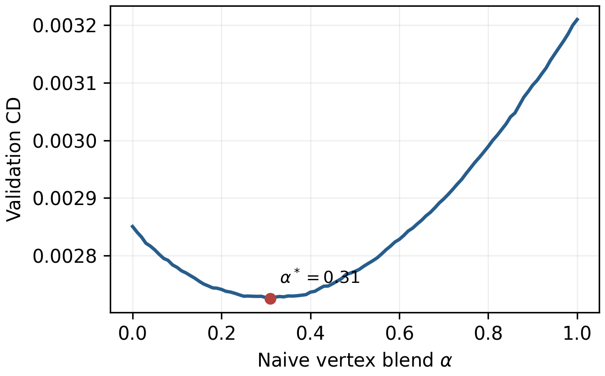
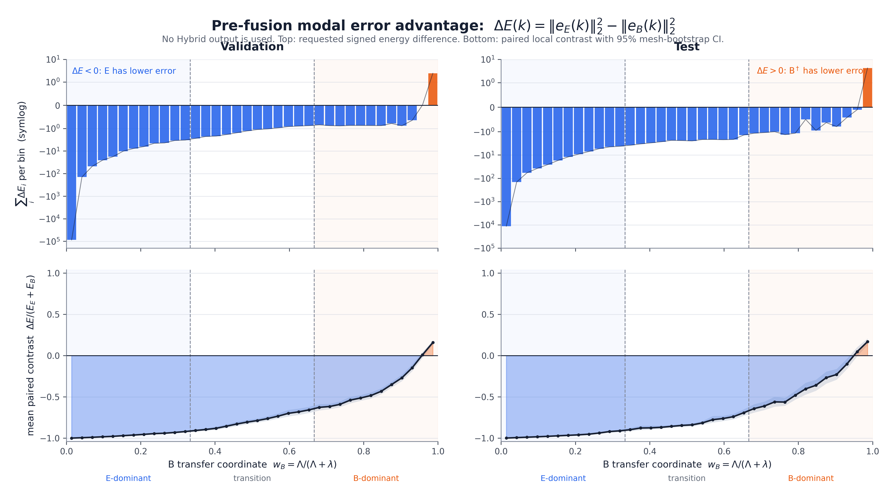
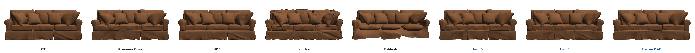
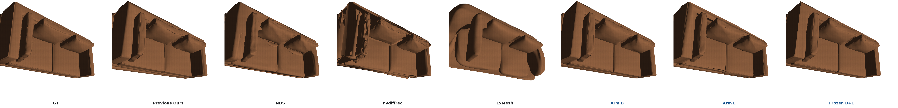

# Recent Sofa50 Arm-B ablations and old-domain same-input comparison

Contract audit: **true**.

This report consolidates recent matched-v2 single-pass Arm-B/Arm-E ablations, a two-domain naive scalar-fusion control, and a separate old native-1920 same-input comparison. The two domains are reported in separate sections and their absolute metric values are not compared across sections.

## Executive findings

- The formal matched-v2 Arm-B should retain the mixed objective `L_raw-Laplacian-Huber + 1e-2 L_recovered-vertex`. Pure recovered-vertex training lowers same-index vertex RMS but worsens surface CD and raw-Laplacian EPE.
- Frozen Arm-E does not rescue the Pure-Vertex Arm-B field. At fusion `lambda=0.03`, Pure-B+E is worse than Original-B+E on every one of the 50 test meshes by CD.
- The existing validation-selected fusion `lambda=0.03` is better than the fixed diagnostic `lambda=0.01` for both B variants. The degradation is especially severe for Pure-B+E.
- Exact transfer spectra show that E changes B primarily in low-response modes and B changes E primarily in high-response modes. A stricter pre-fusion error check sharpens this claim: E is more accurate across most of the response range, while unanchored `B^dagger` has a reproducible advantage only in the strongest-response bin.
- A validation-selected scalar vertex blend improves both standalone branches in both domains, but it does not explain the operator Hybrid. Hybrid beats naive fusion by CD on `43/50` matched-v2 and `21/25` old-domain test meshes; both mesh and five-object cluster-bootstrap intervals exclude zero. The scalar blend instead has the better Normal and same-index Vertex RMS, exposing a real metric trade-off rather than a uniformly dominated baseline.
- On the separate old native-1920 inputs, validation-selected Frozen B+E reaches CD `0.00670460` and improves all 25 meshes. It beats both domain-trained specialists, naive scalar fusion, NDS, nvdiffrec and ExMesh. Arm-E retains the best standalone Vertex RMS (`0.00866400`), while the post-hoc naive blend lowers it further to `0.00792909`. Arm-E and Hybrid were opened once only after checkpoint/lambda lock, while Arm-B had already been opened in the earlier authorized Arm-B-only comparison.
- A matched Direct-Lap A+E control is not meaningfully separated from recovery-aware B+E by surface distance at either `lambda=0.03` or `lambda=0.01`. The paper therefore cannot claim that Arm-B recovery-aware training is necessary for operator composition.
- Training a new B_P field through the Arm-E anchor produces a significant anchor interaction but no same-anchor CD separation from B_0; this is not evidence of a final anchor-conditioned gain.
- Sparse positional constraints improve smoothly with density. Dense B+E is well explained as the 100% endpoint of a densified learned-anchor family, while Song-scale 2% constraints remain far below dense absolute quality.

## A. Matched-v2 loss and fusion ablations

All rows use the same 50 validation and 50 test meshes, 28x960 inputs, Uniform random-walk operator and frozen checkpoints declared by the source reports. `Pure-Vertex Arm-B` changes only the training objective to recovered-vertex MSE. B+E rows use `min_V ||L_U V-delta_B||^2 + lambda ||V-V_E||^2`. Raw EPE is a B-field diagnostic and is inherited unchanged by the corresponding fused row.

| Split | System | CD | P2S p95 | F-score | Normal | Raw EPE | Vertex RMS | Improved/worsened |
|---|---|---|---|---|---|---|---|---|
| validation | Initial mesh | 0.00381765892 | 0.0138686196 | 0.918392483 | 0.976308527 | n/a | 0.031591482 | 0/0 |
| validation | Original Arm-B | 0.00320962349 | 0.00999485296 | 0.950224425 | 0.96877577 | 0.0020152807 | 0.00767549059 | 46/4 |
| validation | Pure-Vertex Arm-B | 0.00345892192 | 0.0107392229 | 0.936345803 | 0.965681501 | 0.0076741744 | 0.00622738242 | 24/26 |
| validation | Arm-E | 0.00285065224 | 0.00891131992 | 0.960090448 | 0.975651504 | n/a | 0.00472553239 | 48/2 |
| validation | Original B+E (lambda=3e-2) | 0.00244916745 | 0.00713319482 | 0.980307047 | 0.97009371 | 0.0020152807 | 0.00542431207 | 50/0 |
| validation | Original B+E (lambda=1e-2) | 0.00256976129 | 0.00748929034 | 0.975889281 | 0.96400505 | 0.0020152807 | 0.0065800354 | 50/0 |
| validation | Pure-Vertex B+E (lambda=3e-2) | 0.00336727057 | 0.0104846605 | 0.940200292 | 0.963813809 | 0.0076741744 | 0.00634253795 | 31/19 |
| validation | Pure-Vertex B+E (lambda=1e-2) | 0.00413467896 | 0.0131315703 | 0.901890269 | 0.956543083 | 0.0076741744 | 0.00909805861 | 13/37 |
| test | Initial mesh | 0.00438635163 | 0.0146957304 | 0.901781516 | 0.969623498 | n/a | 0.0425195806 | 0/0 |
| test | Original Arm-B | 0.00358497023 | 0.0105580821 | 0.935012989 | 0.959365744 | 0.00263985669 | 0.0115531855 | 36/14 |
| test | Pure-Vertex Arm-B | 0.00397816927 | 0.0117444276 | 0.91756792 | 0.959623804 | 0.00857208259 | 0.0105424394 | 27/23 |
| test | Arm-E | 0.00334038817 | 0.0103976753 | 0.943048517 | 0.97011165 | n/a | 0.00822129906 | 45/5 |
| test | Original B+E (lambda=3e-2) | 0.00302983298 | 0.00936588053 | 0.956291439 | 0.962734888 | 0.00263985669 | 0.00923340794 | 49/1 |
| test | Original B+E (lambda=1e-2) | 0.00319840408 | 0.00976125657 | 0.949462916 | 0.955953797 | 0.00263985669 | 0.011047774 | 44/6 |
| test | Pure-Vertex B+E (lambda=3e-2) | 0.00392584093 | 0.0119378263 | 0.919339093 | 0.958359932 | 0.00857208259 | 0.010586856 | 28/22 |
| test | Pure-Vertex B+E (lambda=1e-2) | 0.00469272235 | 0.0140863565 | 0.887183555 | 0.949796227 | 0.00857208259 | 0.0139116846 | 16/34 |

### Primary paired test effects

Differences are candidate minus reference. Positive CD differences favor the reference. Confidence intervals bootstrap meshes; W/L/T is from the candidate's perspective.

| Comparison | CD difference [95% CI] | Candidate W/L/T |
|---|---|---|
| Pure B vs Original B | 0.000393199046 [0.000164230947, 0.000595043315] | 10/40/0 |
| Pure B+E 0.03 vs Original B+E 0.03 | 0.000896007949 [0.000778623463, 0.00101479267] | 0/50/0 |
| Original B+E 0.01 vs 0.03 | 0.000168571097 [0.000113261301, 0.000227099794] | 9/41/0 |
| Pure B+E 0.01 vs 0.03 | 0.000766881413 [0.000609606024, 0.000966560277] | 0/50/0 |

### Fixed lambda=0.01 paired test ablation

This table expands the newly completed fixed-lambda comparison beyond CD. Every difference is `value(lambda=0.01) - value(lambda=0.03)` on the same 50 test meshes. Negative values favor `lambda=0.01` for CD, P2S p95, Raw EPE and Vertex RMS; positive values favor `lambda=0.01` for F-score and Normal. W/L/T is from the `lambda=0.01` candidate's perspective.

| B variant | Metric | 0.01 - 0.03 mean difference [95% CI] | lambda=0.01 W/L/T |
|---|---|---|---|
| Original B+E | CD | 0.000168571097 [0.000113261301, 0.000227099794] | 9/41/0 |
| Original B+E | P2S p95 | 0.000395376032 [0.000138754392, 0.000641774771] | 12/38/0 |
| Original B+E | F-score | -0.00682852275 [-0.00978830411, -0.00411994903] | 5/44/1 |
| Original B+E | Normal | -0.00678109102 [-0.00751648215, -0.00611652243] | 0/50/0 |
| Original B+E | Raw EPE | 0 [0, 0] | 0/0/50 |
| Original B+E | Vertex RMS | 0.00181436611 [0.0015697056, 0.0020814247] | 0/50/0 |
| Pure-Vertex B+E | CD | 0.000766881413 [0.000609606024, 0.000966560277] | 0/50/0 |
| Pure-Vertex B+E | P2S p95 | 0.0021485302 [0.00163041426, 0.00272889629] | 3/47/0 |
| Pure-Vertex B+E | F-score | -0.0321555378 [-0.0413032758, -0.0244528413] | 2/48/0 |
| Pure-Vertex B+E | Normal | -0.00856370477 [-0.00963962628, -0.00753836597] | 0/50/0 |
| Pure-Vertex B+E | Raw EPE | 0 [0, 0] | 0/0/50 |
| Pure-Vertex B+E | Vertex RMS | 0.0033248286 [0.00285097548, 0.00385426127] | 0/50/0 |

For Original B+E, lowering lambda to `0.01` worsens test CD by `0.000168571097` and loses on 41/50 meshes. For Pure-Vertex B+E, it worsens CD by `0.000766881413` and loses on all 50 meshes. Raw EPE is unchanged within each B variant because lambda changes only the frozen fusion solve, not the predicted B field.

The Pure-Vertex objective does optimize its direct target: test vertex RMS is `0.0105424394` versus `0.0115531855` for Original B. But its test CD rises from `0.00358497023` to `0.00397816927`, and raw EPE rises from `0.00263985669` to `0.00857208259`. The fused result shows that lower same-index vertex RMS alone does not preserve the differential field needed for B/E complementarity.

### Naive scalar vertex-space fusion control

This control fuses only the two final standalone vertex arrays,
`V_alpha = alpha V_D + (1-alpha) V_P`. Here `V_D` is the paper's actual
standalone differential reconstruction with its fixed initial-vertex anchor and
`lambda_D=0.01`; no Laplacian field, anchor, RHS, feature or operator weight is
interpolated. The 101-point validation grid selected `alpha*=0.31` by mean CD.
Both endpoint identities were exact: `V_0=V_P` and `V_1=V_D` with maximum
absolute error `0` over all validation vertices.



| Test system | CD | P2S p95 | F-score | Normal | Vertex RMS | Improved/worsened |
|---|---:|---:|---:|---:|---:|---:|
| Original Arm-B | 0.00358497023 | 0.0105580821 | 0.935012989 | 0.959365744 | 0.0115531855 | 36/14 |
| Arm-E | 0.00334038817 | 0.0103976753 | 0.943048517 | 0.970111650 | 0.00822129906 | 45/5 |
| Naive scalar fusion (`alpha*=0.31`) | 0.00318814268 | 0.00971844159 | 0.951832862 | **0.972382154** | **0.00811562345** | 48/2 |
| **Operator Hybrid (`lambda_H=0.03`)** | **0.00302983258** | **0.00936588053** | **0.956291439** | 0.962734888 | 0.00923340794 | **49/1** |

Naive fusion is a strong control: it beats Arm-E on `41/50` meshes and Arm-B
on `37/50` by CD. Nevertheless, Hybrid lowers mean CD by another `4.97%`
relative to naive and wins `43/50`. The paired Hybrid-minus-naive CD difference
is `-0.0001583101` with mesh-bootstrap CI
`[-0.0002334686,-0.0000747634]` and five-object cluster-bootstrap CI
`[-0.0002575031,-0.0000783528]`. Thus ordinary global averaging explains part,
but not all, of the Hybrid gain. The naive row's better Normal and Vertex RMS
also show that the operator Hybrid's advantage is specifically in the reported
surface-distance/F-score objectives, not every geometric metric.

Source reports:

- [Pure-Vertex Arm-B single-pass comparison](../arm_b_recovery_only_single_pass_v1/REPORT.md)
- [Pure-Vertex B+E versus Original B+E at lambda=0.03](../pure_vertex_b_e_fusion_ablation_v1/REPORT.md)
- [Original B+E fixed lambda=0.01](../original_b_e_fusion_lambda1e2_v1/REPORT.md)
- [Pure-Vertex B+E fixed lambda=0.01](../pure_vertex_b_e_fusion_lambda1e2_v1/REPORT.md)
- [Naive scalar vertex-space fusion](../naive_vertex_fusion_v1/REPORT.md)

## B. Exact recovery-operator spectral analysis

This is the existing read-only analysis of the real Original B+E recovery operator `A_R=L_U^T L_U` on all 50 validation and 50 test meshes at the selected `lambda=0.03`. If `A_R V_B_dagger=L_U^T delta_B`, with the component-nullspace gauge copied from `V_E`, then every recovery eigenmode obeys the exact transfer

```text
v_H,k = Lambda_k/(Lambda_k+lambda) v_B_dagger,k
      + lambda/(Lambda_k+lambda) v_E,k.
```

The first table partitions test error using each mesh's relative recovery spectrum: low `[0,1/3)`, mid `[1/3,2/3)` and high `[2/3,1]` of `Lambda/Lambda_max`. Energies sum XYZ error over all test meshes.

| Test signal | Total error energy | Low fraction | Mid fraction | High fraction |
|---|---|---|---|---|
| Original Arm-B error | 102.25649 | +82.85% | +11.23% | +5.91% |
| Arm-E error | 55.865855 | +60.34% | +24.63% | +15.03% |
| Original B+E error | 67.336138 | +74.21% | +16.88% | +8.90% |

Hybrid has lower mid/high error energy than either standalone branch, but Arm-E has lower total error energy. The spectral result therefore supports frequency-dependent complementarity; it does not claim Hybrid dominates E in total vertex error.

### Pre-fusion modal error sanity check

To avoid a circular result caused by the fusion transfer function, this check does not use `H-B` or `H-E`. It projects the two errors that exist before fusion,

```text
e_B(k) = v_B^dagger(k) - v_GT(k)
e_E(k) = v_E(k)        - v_GT(k)
Delta E(k) = ||e_E(k)||_2^2 - ||e_B(k)||_2^2.
```

The figure sums this signed quantity in 36 narrow bins of `w_B=Lambda/(Lambda+0.03)` using order-384 Jackson-Chebyshev spectral projectors. Negative values mean E has lower error; positive values mean the unanchored differential solution has lower error. The upper row is the requested raw energy difference, while the lower row shows paired per-mesh local contrast with 95% bootstrap intervals so the enormous near-null energy does not hide the high-response behavior.



The result is selective rather than a blanket branch split. E is better over almost the full response range. In the strongest-response bin `w_B in [35/36,1]`, however, `B^dagger` wins `48/50` validation and `45/50` test meshes. Its paired local contrast is `+0.1591 [+0.1334,+0.1839]` on validation and `+0.1698 [+0.1300,+0.2089]` on test, so both intervals exclude zero. Integrating the entire nominal B-dominant interval `w_B>=2/3` still favors E (`-0.1055` validation and `-0.0822` test paired contrast). The defensible mechanism claim is therefore that B has a robust advantage in the **highest recovery-response modes**, not that every B-dominant mode is more accurate.

For the actual fusion crossover, E-dominant means `Lambda<lambda/2`, transition means `lambda/2<=Lambda<2lambda`, and B-dominant means `Lambda>=2lambda`. These correspond to B transfer weights below `1/3`, between `1/3` and `2/3`, and above `2/3`.

| Test change signal | E-dominant | Transition | B-dominant |
|---|---|---|---|
| Hybrid - unanchored B reference | +99.86% | +0.13% | +0.01% |
| Hybrid - archived Arm-B | +80.93% | +13.17% | +5.90% |
| Hybrid - Arm-E | +9.58% | +17.18% | +73.24% |

Thus `80.932%` of the Hybrid-versus-archived-B change lies in the E-dominant interval, while `73.240%` of the Hybrid-versus-E change lies in the B-dominant interval. The numerical identity is tight: maximum normal-equation residual `2.839e-12` and maximum transfer reconstruction VRMS `1.005e-11`.

The lambda ablations are consistent with this transfer law. Lowering `lambda` from `0.03` to `0.01` decreases E's weight for every non-null mode and makes the solution trust B more strongly. Combined with Pure-B's much larger raw EPE, this provides a mechanism-level explanation for why `lambda=0.01` hurts Pure-B+E most severely. This last sentence is an inference from the exact Original-B operator spectrum plus the ablation results; no Pure-B-specific spectral decomposition was run.

The recovery spectrum is an operator-response spectrum, not automatically an intrinsic Laplace--Beltrami spectrum. A separate audit found partial correspondence with the Uniform random-walk spectrum (test reverse Spearman `0.93090`, but sampled same-band subspace overlap only `0.54110`) and only a coarse partial proxy for cotangent intrinsic frequency (test Spearman `0.74094` / `0.65287` in the two directions). Therefore the paper can describe low/high **recovery-response modes**, but should not relabel `Lambda` as cotangent frequency.

Source reports:

- [Exact recovery-operator spectrum](../recovery_operator_spectrum_v1/REPORT.md)
- [Pre-fusion modal error sanity check](../pre_fusion_modal_delta_v1/REPORT.md)
- [Uniform random-walk versus recovery spectrum](../uniform_rw_recovery_spectrum_correspondence_v1/REPORT.md)
- [Recovery versus cotangent spectrum](../uniform_cotangent_spectrum_correspondence_v1/REPORT.md)

## C. Old native-1920 same-input multi-metric comparison

This section uses the exact same 25 `v00`--`v04` input meshes, 28 native-1920 images/cameras and unified evaluator for every row. `Previous Ours (original architecture predict)` is the archived pre-domain-retraining predictor from the 2026-08-20 controlled benchmark; it is not a Future2000 transfer result. CD gain is the macro mean of per-mesh relative CD improvement. Vertex RMS is the macro mean of same-index per-mesh vertex RMS to GT and is reported only when vertex ordering is exactly comparable. Mean introduced flips are shown only for connectivity-preserving outputs. The B/E/Frozen rows come from one final-test execution with validation-selected `lambda_old=0.01`; test was not used for specialist or lambda selection. The naive row is a later validation-locked post-hoc blend of those exact cached B/E vertex outputs. Compute time is mean seconds per mesh and excludes the common evaluator.

| Method | CD | P2S p95 | F-score | Normal | Vertex RMS | CD gain | Improved/worsened | Mean introduced flips | Connectivity | Compute s/mesh |
|---|---|---|---|---|---|---|---|---|---|---|
| Initial mesh | 0.0170704685 | 0.0724794854 | 0.577250432 | 0.955190949 | 0.0135981348 | +0.00% | 0/0 | 0 | preserved | 0 |
| Previous Ours (original architecture predict) | 0.0113478004 | 0.0403952873 | 0.647196717 | 0.944514414 | 0.0123391399 | +30.86% | 25/0 | 230.64 | preserved | 7.206399 |
| NDS | 0.0112049924 | 0.0398475607 | 0.652827299 | 0.873805125 | 0.1266179031 | +34.36% | 22/3 | 963.52 | preserved | 227.3096 |
| nvdiffrec | 0.0136546593 | 0.045745772 | 0.558673128 | 0.848122276 | 0.0452140261 | +20.01% | 18/7 | 1609.36 | preserved | 824.982 |
| ExMesh | 0.0201706152 | 0.0696287606 | 0.47851328 | 0.845337056 | n/a | -18.16% | 8/17 | n/a | changed | 762.4004 |
| Old-domain Arm B | 0.0085377693 | 0.0271284035 | 0.716572715 | 0.948334515 | 0.0108807326 | +49.99% | 25/0 | 325.24 | preserved | 2.293578 |
| Old-domain Arm E (best standalone Vertex RMS) | 0.0080658043 | 0.0274944580 | 0.750907436 | 0.954472757 | 0.0086640004 | +52.75% | 25/0 | 302.60 | preserved | 2.320147 |
| Old-domain naive scalar fusion (`alpha*=0.27`) | 0.0075621855 | 0.0261096642 | 0.770400433 | **0.959526044** | **0.0079290880** | +53.10% | 25/0 | 244.04 | preserved | 4.613726 |
| **Old-domain Frozen B+E** | **0.0067045978** | **0.0208419391** | **0.793502547** | 0.949512478 | 0.0104264906 | **+60.72%** | **25/0** | 377.40 | preserved | 4.609947 |

The initial mesh has normal consistency `0.955190949`. Arm-E has the best standalone Vertex RMS (`0.0086640004`), highlighting the direct-vertex specialist's same-index positional advantage. The validation-selected naive blend lowers Vertex RMS further to `0.0079290880`, raises Normal to `0.959526044`, and has fewer introduced flips (`244.04`) than either specialist. Frozen B+E instead provides the best surface CD, P2S p95 and F-score, while increasing introduced flips to `377.40`. No B/E/naive/Frozen output creates a new degenerate face. ExMesh changes topology, so same-index Vertex RMS and flip counts are not comparable and are reported as `n/a`.

### Old-domain naive scalar vertex-space fusion control

The same validation-only protocol selected `alpha*=0.27` from the 101-point
grid. It uses the existing `lambda_D=0.01` standalone B reconstruction and the
existing direct E vertices; the proposed old-domain Hybrid remains fixed at its
independently validation-selected `lambda_H=0.01`. Endpoint vertex errors are
again exactly zero.


Naive fusion beats E on `20/25` and B on `21/25` test meshes by CD. Hybrid still
lowers mean CD by `11.34%` relative to naive and wins `21/25`. The paired
Hybrid-minus-naive CD difference is `-0.0008575877`, with mesh-bootstrap CI
`[-0.0013259847,-0.0004298422]` and five-object cluster-bootstrap CI
`[-0.0016993353,-0.0000428187]`. The object-cluster upper bound is close to zero
but remains negative. As in matched-v2, the outcome supports value beyond scalar
averaging for surface CD/P2S/F-score while recording the opposite Normal/Vertex
RMS trade-off without qualification.

### Eight-method qualitative detail comparisons

Both panels omit Coarse and use a horizontal `1x8` layout in the order GT, Previous Ours, NDS, nvdiffrec, ExMesh, Arm B, Arm E and Frozen B+E. They render the exact meshes in `~/results/2` with one fixed camera and a shared procedural brown-linen appearance for all eight methods within a sample. The texture is a deterministic visualization material, not an RGB model input or recovered UV texture. The panels contain no upper-left content header or sample ID; each method label is centered beneath its mesh. A transparent RGBA master is archived, while the report uses the flattened white-background export recommended for stable paper/PDF rendering. The V01 camera and wide crop follow `QQ_1787904603868.png`: starting from the previous orbit view, the camera moves vertically down the viewing sphere by 90 degrees to the complete sofa front (`elevation=-90 degrees`; `+90 degrees` is the back). The V02 camera and near-square crop follow `QQ_1787904538059.png`: a close low-left oblique view (`azimuth=135 degrees`, `elevation=-20 degrees`) looking along the long edge toward the upper-right.



The bottom-detail panel exposes both loss of local fold separation and unstable high-frequency geometry: ExMesh visibly smooths the cushions, while nvdiffrec introduces severe tearing-like surface artifacts. The four Ours rows preserve the GT fold layout much more closely, with the frozen result retaining the specialist structure after fusion.



The straight-edge panel makes global bending and top-rail waviness visible without changing viewpoint between methods. It complements the aggregate metrics: Arm-E's lowest Vertex RMS reflects its positional accuracy, while Frozen B+E has the strongest surface-distance scores overall.

Rendering provenance, exact OBJ SHA-256 values and camera parameters are recorded in [the qualitative manifest](qualitative_9method/MANIFEST.json). The panels are reproducible with [the eight-method rendering script](../../../scripts/render_old_domain_nine_method_details.py).

### Compute-time breakdown

For the old-domain specialists and fusion, the declared compute-time formulas are

```text
Arm B total = B model forward + B sparse recovery solve
Arm E total = E model forward
Naive total = B model forward + B standalone sparse solve + E model forward
Frozen B+E total = B model forward + E model forward + fusion sparse solve
```

Image/model preparation included inside each measured forward call remains part of forward time. Mesh export, topology diagnostics and the unified geometry evaluator are excluded. Only one refinement application is used; recursive R2--R5 timings and results are outside this formal comparison.

| Method | Model forward s/mesh | Sparse solve s/mesh | Total compute s/mesh | Timing provenance |
|---|---|---|---|---|
| Old-domain Arm B | 2.252271 | 0.041308 | 2.293578 | final-test single pass; L40; evaluator excluded |
| Old-domain Arm E | 2.320147 | 0 | 2.320147 | final-test single pass; L40; evaluator excluded |
| Old-domain naive scalar fusion | 4.572418 | 0.041308 | 4.613726 | derived from the same B/E forwards plus standalone B recovery; interpolation negligible |
| Old-domain Frozen B+E | 4.572418 | 0.037529 | 4.609947 | independent B+E forwards plus float64 fusion; L40; evaluator excluded |
| Previous Ours (original architecture predict) | not separately archived | not separately archived | 7.206399 | archived predictor + legacy recovery pipeline |
| NDS | n/a | n/a | 227.3096 | archived method pipeline |
| nvdiffrec | n/a | n/a | 824.982 | archived method pipeline |
| ExMesh | n/a | n/a | 762.4004 | archived method pipeline |

The Frozen total is therefore `4.572418 + 0.037529 = 4.609947` seconds per mesh. These current rows use the exact locked checkpoint SHAs and same 25 inputs. The external totals and Previous Ours total are historical implementation/hardware measurements from their completed adapters. They are useful operational references, but are not hardware-normalized algorithmic complexity comparisons.

### Frozen B+E final-test paired comparisons

Differences are Frozen B+E minus comparator. Negative CD/P2S and positive F-score/normal favor Frozen. CD confidence intervals are shown both for 25-mesh bootstrap sampling and for five-object cluster bootstrap sampling, with five variants retained within each sampled object.

| Comparator | CD difference [mesh 95% CI] | Object-cluster 95% CI | CD W/L/T | P2S p95 difference | F-score difference | Normal difference |
|---|---:|---:|---:|---:|---:|---:|
| Old-domain Arm B | -0.0018331715 [-0.0024621883, -0.0012539769] | [-0.0029988108, -0.0008916676] | 22/3/0 | -0.0062864644 | 0.076929831 | 0.001177963 |
| Old-domain Arm E | -0.0013612065 [-0.0018119447, -0.0009232948] | [-0.0021255390, -0.0005675016] | 23/2/0 | -0.0066525189 | 0.042595111 | -0.004960278 |
| Naive scalar fusion | -0.0008575877 [-0.0013259847, -0.0004298422] | [-0.0016993353, -0.0000428187] | 21/4/0 | -0.0052677251 | 0.023102114 | -0.010013565 |
| NDS | -0.0045003946 [-0.0052805585, -0.0037927501] | [-0.0058853458, -0.0033796185] | 25/0/0 | -0.0190056217 | 0.140675248 | 0.075707353 |
| nvdiffrec | -0.0069500616 [-0.0078533558, -0.0060381559] | [-0.0085337014, -0.0054727902] | 25/0/0 | -0.0249038330 | 0.234829419 | 0.101390203 |
| ExMesh | -0.0134660174 [-0.0171267291, -0.0101594013] | [-0.0219418620, -0.0066405162] | 25/0/0 | -0.0487868215 | 0.314989266 | 0.104175422 |

Frozen B+E wins `22/25` against B, `23/25` against E and `21/25` against naive fusion by CD, while all corresponding object-cluster intervals remain strictly negative. It wins all 25 meshes against each external method. The normal trade-off is branch-dependent: Frozen slightly improves over B but is lower than E by `0.004960278` and lower than naive by `0.010013565`.

### Earlier paired Old-domain Arm-B comparisons

Differences are Old-domain Arm-B minus comparator. Negative CD/P2S and positive F-score/normal favor Arm-B. Confidence intervals use 10,000 paired mesh bootstraps with seed 7.

| Comparator | Metric | Arm-B minus comparator [95% CI] | Arm-B W/L/T |
|---|---|---|---|
| Previous Ours (original architecture predict) | CD | -0.00281347007 [-0.00363065474, -0.00196536462] | 23/2/0 |
| Previous Ours (original architecture predict) | P2S p95 | -0.0132717107 [-0.0181434117, -0.0087767203] | 22/3/0 |
| Previous Ours (original architecture predict) | F-score | 0.0694606655 [0.0439940256, 0.0940443104] | 22/3/0 |
| Previous Ours (original architecture predict) | Normal | 0.0038062298 [0.00226400822, 0.00530924729] | 21/4/0 |
| NDS | CD | -0.00267066204 [-0.00328516437, -0.00210104792] | 25/0/0 |
| NDS | P2S p95 | -0.012723984 [-0.0153305254, -0.0103158656] | 25/0/0 |
| NDS | F-score | 0.0638300843 [0.0428868531, 0.0845472526] | 21/4/0 |
| NDS | Normal | 0.074515518 [0.069072984, 0.0798139256] | 25/0/0 |
| nvdiffrec | CD | -0.00512032902 [-0.00584849602, -0.00428939188] | 24/1/0 |
| nvdiffrec | P2S p95 | -0.0186221954 [-0.0218316021, -0.0153817412] | 25/0/0 |
| nvdiffrec | F-score | 0.157984255 [0.125018524, 0.18913363] | 24/1/0 |
| nvdiffrec | Normal | 0.100198368 [0.0885485459, 0.111463495] | 25/0/0 |
| ExMesh | CD | -0.0116362849 [-0.0153037024, -0.00833259494] | 25/0/0 |
| ExMesh | P2S p95 | -0.0425051839 [-0.0574549471, -0.0289077047] | 25/0/0 |
| ExMesh | F-score | 0.238144103 [0.203772308, 0.272732421] | 25/0/0 |
| ExMesh | Normal | 0.102983587 [0.0882529088, 0.118096106] | 25/0/0 |

Against the Previous Ours prediction, the domain-trained Arm-B reduces mean CD by `-0.00281347007` and wins 23/25 paired meshes in the earlier authorized comparison. Those rows remain as provenance for the specialist result; the frozen final-test table above is the current full B/E comparison.

Source reports:

- [Old-domain Arm-B versus external methods](../../sofa50_old_domain_native1920_b_e_v1/arm_b_external_comparison_v1/REPORT.md)
- [Old-domain Frozen B+E final test](../../sofa50_old_domain_native1920_b_e_v1/frozen_final_test/REPORT.md)
- [Old-domain naive scalar vertex-space fusion](../../sofa50_old_domain_native1920_b_e_v1/naive_vertex_fusion_v1/REPORT.md)
- [Previous Ours controlled same-input archive](../../synthetic_same_initial_benchmark_20260820/full_report/FINAL_REPORT.md)

## D. Post-consolidation formulation stress tests

These three completed Sofa50-v2 controls narrow the methodological claim while
leaving the measured dense Hybrid result unchanged.

### Direct-Laplacian A+E versus recovery-aware B+E

Both systems use the same frozen Arm-E vertices, topology, Uniform random-walk
operator, evaluator and lambda; only the frozen differential field changes.
At `lambda=0.03`, A+E reaches CD `0.00298590286` versus B+E `0.00302983298`.
The paired A+E-minus-B+E CD difference is `-0.0000439301`, with mesh CI
`[-0.0001327670,0.0000454902]` and object-cluster CI
`[-0.0000981586,0.0000102983]`. At `lambda=0.01`, A+E reaches
`0.00314165525` versus B+E `0.00319840408`; the difference is
`-0.0000567488`, with mesh CI `[-0.0001786322,0.0000698453]` and object CI
`[-0.0001501462,0.0000348107]`. Both comparisons are therefore classified
**NO MEANINGFUL DIFFERENCE** for the primary surface-distance claim. A+E has a
positive Normal advantage at both lambdas. These controls do not support the
necessity of recovery-aware Arm-B training for the downstream composition.

### Anchor-conditioned differential training

Arm B_P changes only the training recovery-loss anchor from the initial mesh
to cached detached Arm-E vertices. On the same test anchor and `lambda=0.01`,
B_P@V_P minus B_0@V_P CD is `-0.0000170336`, with mesh CI
`[-0.0001463599,0.0001160982]`, object CI
`[-0.0000972939,0.0000594241]` and W/T/L `30/0/20`. The cross-anchor
interaction is significantly negative, but the final same-anchor comparison
does not separate; the verdict remains **NO EVIDENCE FOR ANCHOR CONDITIONING**.

### Sparse positional-constraint density

With frozen B/E predictions and fixed per-anchor `lambda=0.03`, test CD falls
monotonically across nested densities: `0.0330216` (0%), `0.0149164` (1%),
`0.0104134` (2%), `0.00595884` (5%), `0.00443109` (10%), `0.00348103`
(25%), `0.00314561` (50%) and `0.00302983` (100%). The 2% condition is
`243.70%` above dense and loses on all 50 paired meshes; even normalized-energy
2% remains `130.23%` above dense. The empirical classification is therefore
**DENSE_B_E_IS_WELL_EXPLAINED_AS_DENSIFIED_LEARNED_ANCHORING**. This records a
strong formulation-level predecessor while also showing that low Song-scale
density is insufficient in this implementation.

Source reports:

- [Direct-Lap A+E versus B+E at lambda=0.03](../direct_lap_positional_matched_fusion_v1/REPORT.md)
- [Direct-Lap A+E versus B+E at lambda=0.01](../direct_lap_positional_matched_fusion_lambda1e2_v1/REPORT.md)
- [Anchor-conditioning ablation](../anchor_conditioning_ablation_v1/REPORT.md)
- [Sparse positional-density ablation](../sparse_positional_density_ablation_v1/REPORT.md)

## E. How the 28-view RGB observations are generated and used

The 28 observations follow the deterministic nested layout
`cube_surface_nested_fps_antipodal_14_28_56_cpu_master_v3`. They are not 28
random orbit samples:

1. **Base 14 views.** Six cameras lie at the positive and negative coordinate-axis
   face centres of a cube with half extent `1.5`; eight cameras lie at its corners.
2. **Added 14 views.** Seven farthest-point-selected directions are added together
   with their antipodal partners. This fills the largest angular gaps left by the
   base layout while preserving opposite-view balance. The 28-view set is an exact
   prefix of the 56-view master, so the 14/28/56 view-count ablation is nested rather
   than comparing unrelated camera samples.
3. **Camera model.** Every camera looks at the origin under the right-handed CV
   convention (`+Z` forward, `+X` image-right, `+Y` image-down). At 960 resolution,
   the field of view is `90` degrees, `fx=fy=480`, and `cx=cy=480`.

For Future2000, the first 14 prepared RGB images are reused unchanged from the
upstream object observation. Only views 15--28 are newly rendered. The additional
views use the same clean source surface, fixed cameras and OpenGL/EGL renderer at
`960x960`, with four-sample MSAA, CCW winding and lit shading. RGB rendering is
two-sided; visibility is handled separately. The object is already in the prepared
canonical coordinate frame and is not renormalized during this extension.

Each object is rendered once, not once per coarse mesh. Its five synthetic-current
variants therefore share exactly the same 28 RGB images and camera matrices. The
variant changes the current vertices/connectivity and query graph, while the visual
observation stays fixed. This prevents view changes from becoming a confound in the
refinement comparison.

Masks and depth images for the added views are not persisted or supplied to the
predictor. Instead, for every current-mesh variant, renderer visibility is recomputed
from that variant's own graph with a depth-tested face-ID rasterization. Training uses
the `backface_and_occlusion` mask, so a current vertex contributes image evidence only
when it is inside the camera frustum and visible under the current graph. GT depth,
GT visibility and vertex correspondence are not model inputs.

Inside Arm-B, the 28 RGB images are processed by a shared image encoder. The HF model
does not render extra images: from each encoded feature map `F`, it constructs
`[F, F-G_sigma(F)]` using a fixed `5x5`, `sigma=1` Gaussian blur. Current vertex/query
positions are projected with each view's intrinsics and extrinsics; bilinear features
are sampled at those projected locations, invalid/hidden samples are masked, and the
remaining per-view features are mean-aggregated for each vertex. These visual features
are then combined with current-graph geometry before predicting the raw Laplacian.
Execution may process four views at a time to control memory, but all 28 views enter
the same final per-vertex aggregation.

The choice of 28 is empirical as well as structural: it preserves the nested camera
protocol and gave a better validation-loss trade-off than 14 or 56 in the completed
Sofa50 view-count study. The 56-view arm improved some raw-error tails but did not
consistently improve the selection metric and cost substantially more runtime.

Implementation sources:

- [Future2000 28-view preparation](../../../scripts/prepare_future2000_synthetic_current_28view.py)
- [Camera and OpenGL renderer](../../../src/mlr/synthetic.py)
- [Projection and bilinear feature sampling](../../../src/mlr/learned_laplacian/projection.py)
- [HF feature construction](../../../src/mlr/learned_laplacian/image_encoder.py)

## Contract and numerical audit

- Matched-v2: 50 validation and 50 test meshes; all four source classifications and contract audits were checked before aggregation.
- Naive scalar fusion: no predictor was retrained and no checkpoint, split, evaluator or reconstruction lambda changed. The exact vertex endpoints passed with maximum absolute error `0`; validation selected `alpha=0.31` for matched-v2 and `alpha=0.27` for old native-1920 before one locked test evaluation per domain.
- Hybrid-versus-naive paired CD: matched-v2 mesh CI `[-0.0002334686,-0.0000747634]`, object-cluster CI `[-0.0002575031,-0.0000783528]`; old-domain mesh CI `[-0.0013259847,-0.0004298422]`, object-cluster CI `[-0.0016993353,-0.0000428187]`.
- Recovery spectrum: all 100 matched-v2 meshes passed; Original B/E checkpoint hashes match the ablation inputs; no Pure-B-specific spectral run is claimed.
- Pre-fusion modal error: all 100 meshes passed; no Hybrid output was read; maximum spectral-partition residual `1.993e-13`, component-gauge mismatch `4.552e-15`, and normal-equation residual `2.839e-12`.
- Old domain: 25 exact sample IDs match across the locked B/E/Frozen run and the archived external comparison.
- Old-domain Vertex RMS: all connectivity-preserving rows were recomputed from the exact `~/results/2` OBJ bundle with same-index GT vertices; all 25 vertex arrays and face-index arrays matched for each reported row. ExMesh was excluded because it changes topology.
- Old-domain E/Hybrid final test: one opening after specialist and `lambda_old=0.01` lock; test was not used for selection and no test lambda sweep occurred. Arm-B test had already been opened in the earlier authorized specialist comparison, so `fully_sealed_all_methods=false`.
- Old-domain timing: exact checkpoint and samples; forward plus declared sparse solve only; evaluator excluded.
- Frozen solver: all float64 PCG solves converged at tolerance `1e-8`; maximum relative residual `9.977e-09`; no new degeneracies.
- Maximum repeated initial-CD discrepancy between the two old-domain archives: `2.728e-09`.
- Old-domain metric protocol: `mlr.learned_laplacian.evaluation.evaluate_mesh_geometry;area_weighted_triangle_surface_sampling;bidirectional_sampled_surface_to_exact_triangle_surface;surface_samples=3000;seed=7;fscore_threshold=0.01;alignment=shared_prepared_coordinate_frame_no_ICP`.
- Archived NDS, nvdiffrec and ExMesh aggregates reproduce the prior same-input archive: `true`.
- No model was trained, checkpoint selected or reconstruction lambda searched to create this consolidation. The only new selection is the explicitly declared validation-only scalar `alpha` sweep; test data were not used to choose it.
- Old-domain E/Hybrid sealed final: `true`; fully sealed across all methods: `false` because of the earlier Arm-B-only opening.
- Direct-Lap A+E controls: both lambdas use the identical E array, ordered 50-mesh test set, GT, topology, Uniform operator and evaluator as B+E. Arm-A checkpoint direct rehash is unavailable locally, but archived prediction metadata, IDs/order, byte-identical target and raw-EPE checks pass; this provenance warning is retained.
- Anchor conditioning: exactly one B_P model was trained; cached Arm-E anchors were detached and never entered predictor inputs. Same-anchor primary CD CIs cross zero despite the significant interaction.
- Sparse density: no model or inference changed; the 0% and 100% endpoints reproduce the established unanchored and dense implementations, all positive-density PCG solves converged, and no additional subset seeds were triggered by the prespecified smoothness/significance rule.
