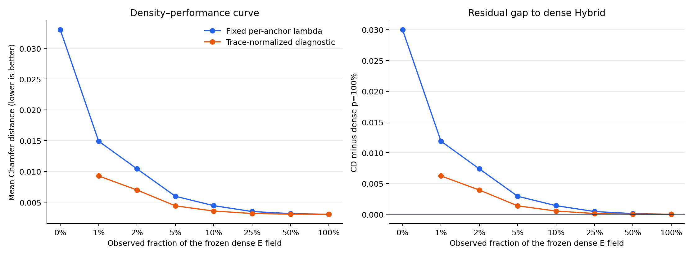

# Sofa50 sparse positional-constraint density ablation

Contract audit: **true**. No model was trained and no network inference ran. Frozen Arm-B and Arm-E prediction arrays, topology, evaluator, Uniform random-walk operator, and validation-selected `lambda=0.03` are unchanged; only the binary subset through which recovery observes the dense E field varies.

## 1. Implementation and endpoint verification

Each mesh receives one deterministic SHA-256-seeded uniform random vertex permutation. Density subsets are nested prefixes of that permutation. The meshes have multiple connected components; when a globally uniform subset leaves a component without a sampled vertex, the singular nullspace is resolved with the existing `B^dagger` convention: that component retains Arm-E's component centroid. This is a gauge choice among objective minimizers, not an additional sampled positional penalty.

- `p=100%` masked vs existing dense PCG: maximum/mean vertex distance `0.000e+00` / `0.000e+00`; maximum objective difference `6.245e-16`; maximum archived-CD discrepancy `4.495e-09`.
- `p=0%` directly reuses the existing exact LSMR `B^dagger` implementation with the same E component gauge; its endpoint identity maximum/mean vertex distance is `0.000e+00` / `0.000e+00`. Maximum normal-equation relative residual is `2.892e-12` and maximum component-gauge mismatch is `4.552e-15`.
- Every positive-density solve converged using the existing float64 block-PCG recurrence at tolerance `0.0001` and maximum `2048` iterations. The singular 0% endpoint uses the established high-precision LSMR reference instead of accepting a tolerance-level low-mode PCG error.

## 2. Main fixed-lambda density table

The primary experiment keeps the existing per-anchor `lambda=0.03`. CD deltas are candidate minus reference, so negative versus initial/unanchored is better and positive versus dense is worse.

| Split | E density | CD | CD delta vs initial | CD delta vs dense | CD delta vs unanchored | Dense gain recovered | Improved/worsened | P2S p95 | F-score | Normal | VRMS | Unanchored components |
|---|---:|---:|---:|---:|---:|---:|---:|---:|---:|---:|---:|---:|
| validation | 0% | 0.0280147672 | 0.0241971082 | 0.0255655994 | 0 | 0.00% | 0/50 | 0.106903839 | 0.379722457 | 0.87356593 | 0.157253354 | 890 |
| validation | 1% | 0.00917562119 | 0.00535796226 | 0.00672645342 | -0.018839146 | 73.69% | 0/50 | 0.0301913468 | 0.726537096 | 0.935582912 | 0.0254791749 | 82 |
| validation | 2% | 0.0068281282 | 0.00301046928 | 0.00437896043 | -0.021186639 | 82.87% | 1/49 | 0.0223268725 | 0.80720457 | 0.94164746 | 0.0186541254 | 49 |
| validation | 5% | 0.00450794778 | 0.000690288857 | 0.00205878001 | -0.0235068194 | 91.95% | 11/39 | 0.0143787117 | 0.901072262 | 0.948398435 | 0.0128226576 | 19 |
| validation | 10% | 0.00351149415 | -0.000306164776 | 0.00106232638 | -0.024503273 | 95.84% | 34/16 | 0.0108419669 | 0.940586508 | 0.954129471 | 0.00993314159 | 6 |
| validation | 25% | 0.00277093969 | -0.00104671923 | 0.000321771926 | -0.0252438275 | 98.74% | 48/2 | 0.00825129805 | 0.968125484 | 0.961005115 | 0.00742760911 | 1 |
| validation | 50% | 0.00253658086 | -0.00128107806 | 8.74130926e-05 | -0.0254781863 | 99.66% | 50/0 | 0.00743233014 | 0.977200544 | 0.965647673 | 0.00623837492 | 0 |
| validation | 100% | 0.00244916777 | -0.00136849116 | 0 | -0.0255655994 | 100.00% | 50/0 | 0.00713319482 | 0.980307047 | 0.97009371 | 0.00542431207 | 0 |
| test | 0% | 0.0330215566 | 0.028635205 | 0.029991724 | 0 | 0.00% | 0/50 | 0.126854071 | 0.366987373 | 0.890384663 | 0.106851573 | 880 |
| test | 1% | 0.0149163848 | 0.0105300332 | 0.0118865522 | -0.0181051718 | 60.37% | 1/49 | 0.0600013606 | 0.676285243 | 0.921981674 | 0.0472186211 | 128 |
| test | 2% | 0.0104134194 | 0.00602706773 | 0.00738358677 | -0.0226081372 | 75.38% | 3/47 | 0.0392378495 | 0.7601376 | 0.928028851 | 0.034272178 | 88 |
| test | 5% | 0.00595883568 | 0.00157248405 | 0.00292900309 | -0.0270627209 | 90.23% | 11/39 | 0.0188383934 | 0.853242373 | 0.937200151 | 0.0212391251 | 44 |
| test | 10% | 0.00443109306 | 4.47414306e-05 | 0.00140126047 | -0.0285904635 | 95.33% | 24/26 | 0.0137878339 | 0.90323211 | 0.943836568 | 0.0163168419 | 26 |
| test | 25% | 0.0034810257 | -0.000905325927 | 0.000451193113 | -0.0295405309 | 98.50% | 40/10 | 0.0106048756 | 0.938897995 | 0.952399249 | 0.0124316966 | 8 |
| test | 50% | 0.00314560679 | -0.00124074484 | 0.000115774202 | -0.0298759498 | 99.61% | 45/5 | 0.00973593937 | 0.951622249 | 0.95790769 | 0.0104850008 | 0 |
| test | 100% | 0.00302983259 | -0.00135651904 | 0 | -0.029991724 | 100.00% | 49/1 | 0.00936588053 | 0.956291439 | 0.962734888 | 0.00923340794 | 0 |

## 3. Density trend and Song-scale result

Classification: **Outcome A — simple density explanation**. Test CD decreases monotonically over every prescribed nested density, and the normalized-energy diagnostic is also monotone. There is no abrupt high-density transition: the dense method is the endpoint of a smooth densified-anchor family.
The 2%, 10% and 50% conditions recover `75.38%`, `95.33%` and `99.61%` of the CD improvement from unanchored `B^dagger` to dense `p=100%`. This fraction is descriptive but not an equivalence measure because unanchored `B^dagger` is catastrophically poor.
At the Song-2020-scale 2% condition, CD minus dense is `0.00738358677` with mesh CI `[0.00537870556, 0.00985910917]`, object-cluster CI `[0.00346876807, 0.0136694451]`, and W/L/T `0/50/0`.
In absolute terms, fixed-lambda 2% and 10% CD are `243.70%` and `46.25%` above dense; both lose to dense on all 50 test meshes. The curve first beats the common initial mesh clearly at 25% (`40/50` improved), while 50% is close but remains `3.82%` above dense and loses on 37/50 meshes.
No additional subset seeds were triggered: the aggregate curve is smooth and monotone, and the 2%/10% dense gaps have mesh and object-cluster intervals strictly above zero with 0/50 wins. This does not claim zero mask variance; it records why variance is not material to the primary conclusion.

## 4. Fixed lambda versus normalized-energy diagnostic

The diagnostic uses `lambda_p=0.03/(p/100)`, keeping the expected trace of the positional diagonal approximately constant. It does not replace the primary result.

| E density | Per-anchor lambda | Fixed-lambda CD | Normalized-energy CD | Fixed delta vs dense | Normalized delta vs dense |
|---:|---:|---:|---:|---:|---:|
| 1% | 3 | 0.0149163848 | 0.00926501142 | 0.0118865522 | 0.00623517883 |
| 2% | 1.5 | 0.0104134194 | 0.0069756813 | 0.00738358677 | 0.00394584871 |
| 5% | 0.6 | 0.00595883568 | 0.00440466756 | 0.00292900309 | 0.00137483497 |
| 10% | 0.3 | 0.00443109306 | 0.00355940105 | 0.00140126047 | 0.000529568463 |
| 25% | 0.12 | 0.0034810257 | 0.00316468184 | 0.000451193113 | 0.000134849249 |
| 50% | 0.06 | 0.00314560679 | 0.00305885264 | 0.000115774202 | 2.90200467e-05 |
| 100% | 0.03 | 0.00302983259 | 0.00302983259 | 0 | 0 |

Normalization improves every sparse condition but does not close the Song-scale gap: normalized 2% remains `130.23%` above dense, and normalized 10% remains `17.48%` above dense. Thus reduced total E-term magnitude explains part, but not all, of the fixed-lambda density effect.

## 5. Recovery-response comparison

Sparse systems do not share the dense transfer eigenbasis. For comparability only, each sparse-minus-reference geometry is projected into the already defined response bands of `A=L_U^T L_U` at dense `lambda=0.03`; this measures where the resulting change lies, not a diagonal sparse transfer law.

| Density | Reference | Mean vertex RMS | E-dominant fraction | Transition fraction | B-dominant fraction |
|---:|---|---:|---:|---:|---:|
| 2% | unanchored_B_dagger | 0.0960677073 | 99.95% | 0.05% | 0.01% |
| 2% | standalone_B | 0.034028572 | 98.43% | 1.33% | 0.24% |
| 2% | Arm_E | 0.0334052168 | 94.26% | 2.63% | 3.11% |
| 2% | dense_p100 | 0.031029727 | 99.03% | 0.90% | 0.07% |
| 10% | unanchored_B_dagger | 0.102413841 | 99.94% | 0.05% | 0.01% |
| 10% | standalone_B | 0.0143450843 | 90.87% | 7.53% | 1.60% |
| 10% | Arm_E | 0.0150243436 | 66.43% | 14.19% | 19.38% |
| 10% | dense_p100 | 0.0108255026 | 92.50% | 6.89% | 0.62% |
| 50% | unanchored_B_dagger | 0.104920125 | 99.90% | 0.09% | 0.01% |
| 50% | standalone_B | 0.00791842736 | 81.99% | 13.18% | 4.82% |
| 50% | Arm_E | 0.00872032871 | 23.43% | 21.92% | 54.64% |
| 50% | dense_p100 | 0.00263816031 | 74.95% | 21.11% | 3.93% |
| 100% | unanchored_B_dagger | 0.105405295 | 99.86% | 0.13% | 0.01% |
| 100% | standalone_B | 0.00718365721 | 80.96% | 13.16% | 5.88% |
| 100% | Arm_E | 0.00720662191 | 9.49% | 17.26% | 73.25% |
| 100% | dense_p100 | 0 | 0.00% | 0.00% | 0.00% |

## 6. Operator interpretation

For sparse density, recovery uses `A + lambda M_p`, where `M_p=S_p^T S_p` is a binary diagonal mask. Except at the endpoints, `M_p` generally does not commute with `A`, so it mixes the dense recovery eigenmodes and no scalar gate `Lambda/(Lambda+lambda)` exists. At 100%, `M_p=I`, the commutator is exactly zero, the eigenbasis is shared, and the existing dense gate is recovered.

| Density | Mean relative distance of mask from I | Mean relative commutator norm | Maximum relative commutator norm |
|---:|---:|---:|---:|
| 0% | 1 | 0 | 0 |
| 1% | 0.994966726 | 0.0725007702 | 0.0734897262 |
| 2% | 0.989929278 | 0.101941855 | 0.103085795 |
| 5% | 0.974662055 | 0.15861229 | 0.160513384 |
| 10% | 0.948664782 | 0.21831668 | 0.220049298 |
| 25% | 0.866016391 | 0.315033567 | 0.318055022 |
| 50% | 0.707096987 | 0.363681858 | 0.367458843 |
| 100% | 0 | 0 | 0 |

## 7. Verdict and Song-2020 implication

Classification: **DENSE_B_E_IS_WELL_EXPLAINED_AS_DENSIFIED_LEARNED_ANCHORING**.

The experiment supports the density explanation: dense B+E is well described as the 100% endpoint of a smoothly improving learned-anchor reconstruction family. It does not support a claim that the dense positional field enters an abrupt or qualitatively separate empirical regime.

The important qualification is that Song-scale sparsity is not sufficient here. At 2%, and still at 10% under fixed per-anchor lambda, the reconstruction does not reproduce the dense method's absolute geometry quality. Medium-to-high density (25–50%) is required before performance approaches the dense endpoint. Therefore Song-2020 is a strong formulation-level predecessor, while the measured gain in this implementation depends materially on densifying its positional constraints.

The conclusion above follows the observed curve and is not selected to protect the current method. It is scoped to frozen single-pass Sofa50-v2, deterministic uniform nested subsets, and the locked dense-fusion lambda.

## Reproducibility

- Git HEAD: `1b70e5a7162e18d6f8ac00eebc3ca11bce6ec6e9`.
- Arm-B checkpoint SHA-256: `a483e2212f568e771873594cf1e37d13d62cbd2e1e72244baded7dd15573970c`; Arm-E checkpoint SHA-256: `6ed27da8759b7bd752ffa75ea8dac3977dd4ced358b5282e0c1c68f750dbade1`.
- Metric protocol: `mlr.learned_laplacian.evaluation.evaluate_mesh_geometry;area_weighted_triangle_surface_sampling;bidirectional_sampled_surface_to_exact_triangle_surface;surface_samples=3000;seed=7;fscore_threshold=0.01;alignment=shared_prepared_coordinate_frame_no_ICP`.
- Sampling seed: `7`; bootstrap replicates: `10000`; response projector order: `128`.
- Raw per-mesh metrics, endpoint audits, paired mesh/object bootstrap results, response decompositions, operator diagnostics, and shard payloads are stored beside this report.
