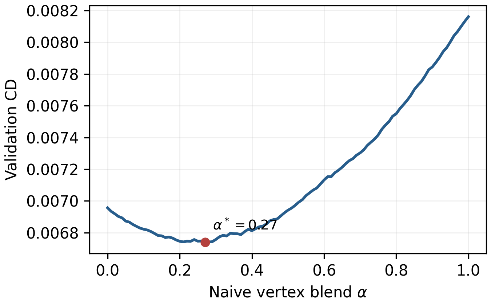

# Naive scalar vertex fusion — old_native1920

Contract audit: **true**.

The predictors and reconstruction contracts are frozen. The scalar coefficient was selected only on validation by minimum macro mean CD, then evaluated once on test.

Validation-selected `alpha* = 0.27`.

The selected validation point and the complete 101-point multi-metric curve are archived in `selection_lock.json` and `validation_alpha_sweep.csv`.

| Method | CD | P2S p95 | F-score | Normal | Vertex RMS | Improved/worsened |
|---|---:|---:|---:|---:|---:|---:|
| Initial mesh | 0.0170704685 | 0.0724794854 | 0.577250432 | 0.955190949 | 0.0135981348 | 0/0 |
| Operator-Mediated Differential | 0.0085377694 | 0.0271284035 | 0.716572715 | 0.948334515 | 0.0108807326 | 25/0 |
| Direct Positional | 0.0080658041 | 0.0274944581 | 0.750907436 | 0.954472756 | 0.0086640004 | 25/0 |
| Naive scalar fusion | 0.0075621855 | 0.0261096642 | 0.770400433 | 0.959526044 | 0.0079290880 | 25/0 |
| Proposed operator Hybrid | 0.0067045978 | 0.0208419391 | 0.793502547 | 0.949512479 | 0.0104264906 | 25/0 |

## Paired CD comparisons

Differences are candidate minus reference; negative values favor the candidate.

| Candidate vs reference | Mean difference [mesh 95% CI] | Object-cluster 95% CI | W/L/T |
|---|---:|---:|---:|
| Naive scalar fusion vs Direct Positional | -0.0005036186 [-0.0006755008, -0.0003353814] | [-0.0007271347, -0.0002844386] | 20/5/0 |
| Naive scalar fusion vs Operator-Mediated Differential | -0.0009755839 [-0.0014201462, -0.0005331919] | [-0.0017159766, -0.0001986544] | 21/4/0 |
| Proposed operator Hybrid vs Naive scalar fusion | -0.0008575877 [-0.0013259847, -0.0004298422] | [-0.0016993353, -0.0000428187] | 21/4/0 |

On mean paired test CD, the proposed Hybrid **outperforms** the locked naive scalar fusion by `-0.0008575877` (Hybrid minus naive).

Metric protocol: `mlr.learned_laplacian.evaluation.evaluate_mesh_geometry;area_weighted_triangle_surface_sampling;bidirectional_sampled_surface_to_exact_triangle_surface;surface_samples=3000;seed=7;fscore_threshold=0.01;alignment=shared_prepared_coordinate_frame_no_ICP`.
